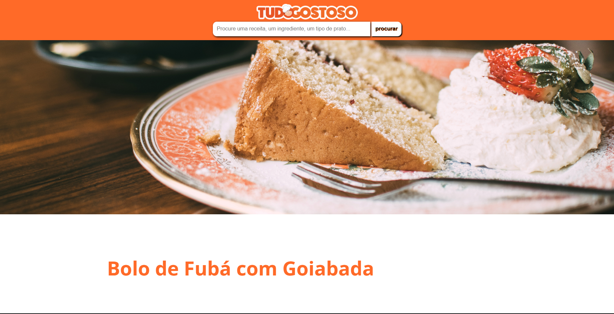
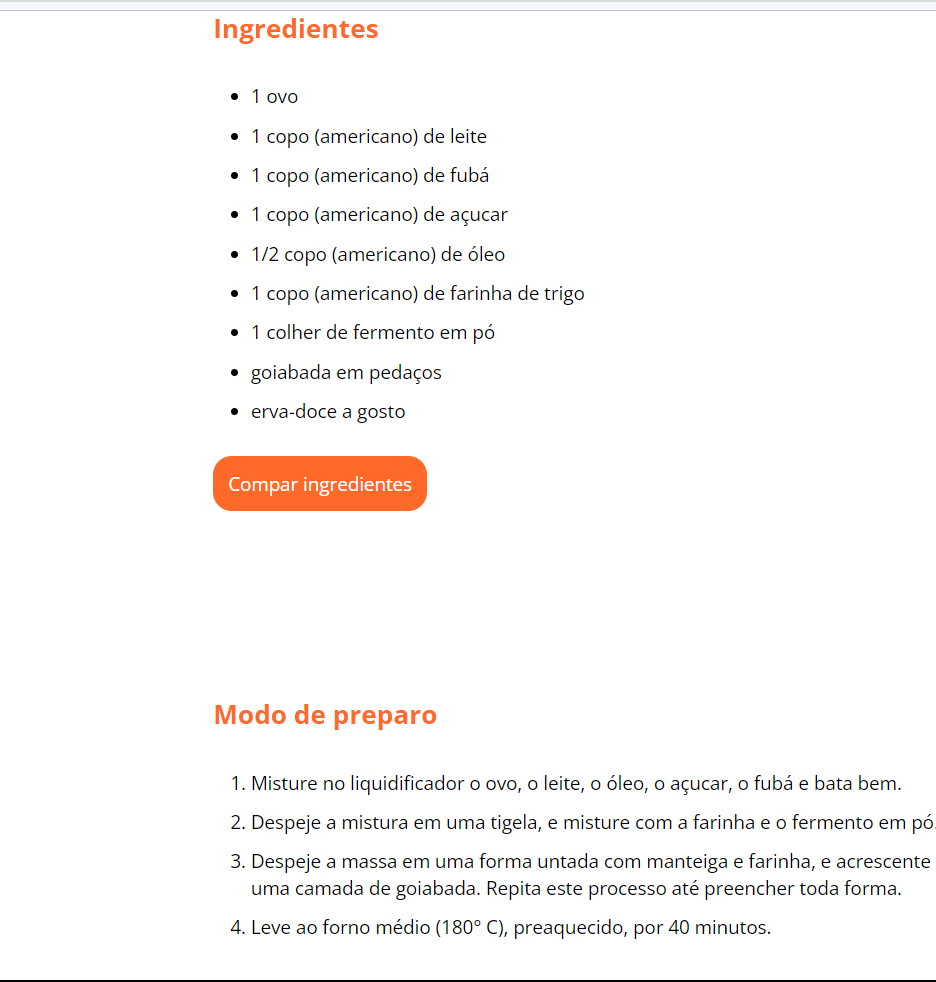
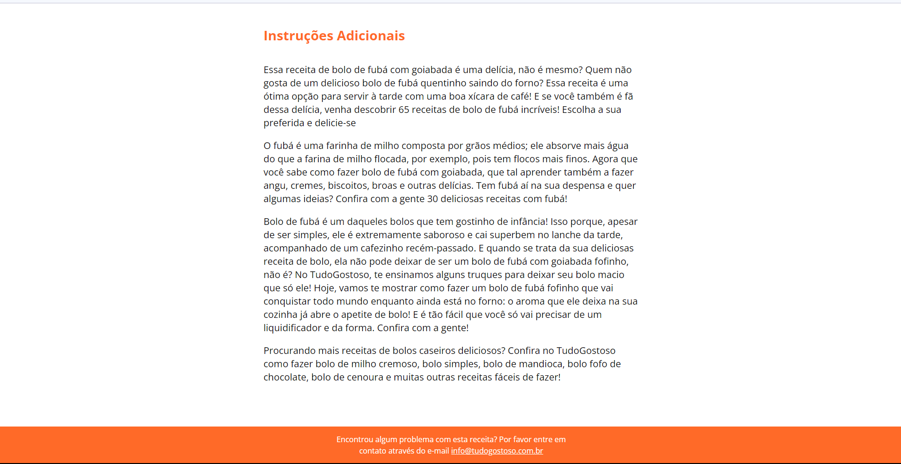

><h1>Página de Receita</h1>

<h2 align="center">
  Acesse a Página clicando <a target="_blank" href="https://erick-sarges.github.io/Pagina-de-receita/">AQUI</a>!
</h2>

 

  <a href="#clipboard-sobre-o-projeto">Sobre o Projeto</a>&nbsp;&nbsp;&nbsp;|&nbsp;&nbsp;&nbsp;
  <a href="#computer-tecnologias-utilizadas">Tecnologias</a>

## :clipboard: Sobre o Projeto

Uma página simples de receita, feita para testar conceitos do pré-processador Sass. Esse projeto teve como base a página Tudo Gostoso.

## :computer: Tecnologias utilizadas
O projeto foi desenvolvido utilizando as seguintes tecnologias:
- <b>HTML</b>
- <b>Sass</b>
- <b>Scss</b>